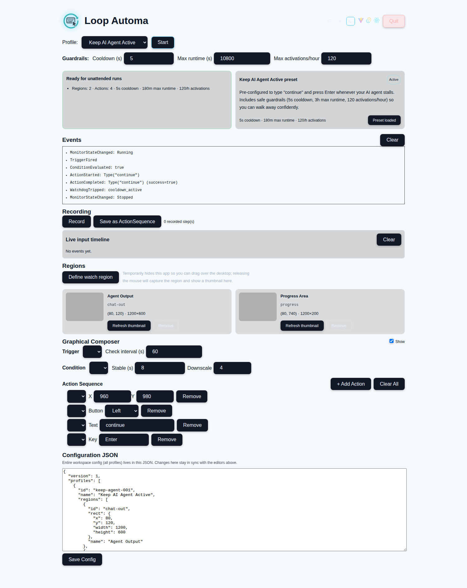
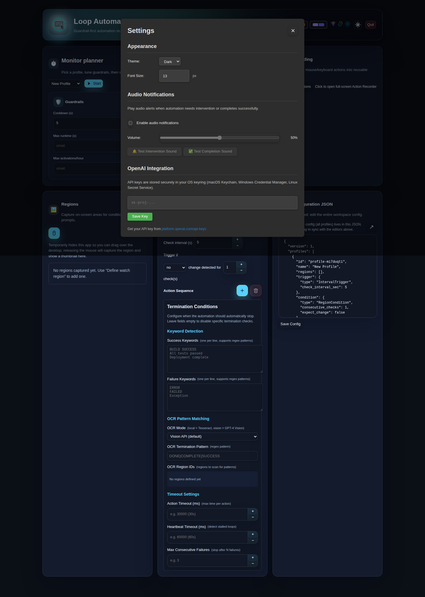

# LoopAutoma


[](https://github.com/chrisgleissner/loopautoma/actions/workflows/ci.yaml)
[](https://codecov.io/gh/chrisgleissner/loopautoma)
[](LICENSE)
[](doc/architecture.md)

> [!NOTE]
> This project is under active development and not yet fully functional. Some of this documentation refers to not yet fully implemented features.

Cross‑platform desktop automation that watches configurable screen regions and performs keyboard/mouse actions when conditions are met.

## Features

- **Keep agents moving**: automatically type "Continue" and press enter when an agent stalls.
- **AI-powered automation**: Use OpenAI's GPT-4 Vision to analyze screen content and generate intelligent prompts with built-in risk assessment (requires API key).
- **Intelligent termination**: Profiles stop automatically when tasks complete via:
  - AI task completion detection (structured LLM responses)
  - OCR pattern matching (success/failure keywords with regex)
  - Timeout guardrails (action timeout, heartbeat watchdog, consecutive failures)
  - Audio notifications for user intervention or completion
- **Secure credential storage**: API keys stored in OS keyring (macOS Keychain, Windows Credential Manager, Linux Secret Service) — never in plaintext.
- **Flexible conditions**: Trigger actions after N consecutive checks with no changes or when changes are detected.
- **Run unattended**: detect stable/changed UI regions and advance workflows automatically.
- **Stay safe**: risk thresholds, cooldowns, rate limits, and guardrails to keep automation bounded.
- **Modern UI**: dual light/dark palettes, visual action icons (mouse, keyboard, sparkles), responsive layout, and inline tooltips.
- **Settings panel**: Configure theme, font size, OpenAI API key, and audio notifications via a centralized Settings dialog (gear icon in header).

## Quick Start Tutorial



Need a detailed walkthrough of every panel? Read the [User Manual](doc/userManual.md).

**[Download the latest release](https://github.com/chrisgleissner/loopautoma/releases/latest)** with pre-built installers for Linux, macOS, and Windows.

Available formats:

- **Linux**: .deb, .rpm, AppImage
- **macOS**: .dmg (Intel and Apple Silicon)
- **Windows**: .exe installer and .msi

### Ubuntu/Debian Example

```bash
# Download the .deb from releases page, then install
sudo apt install ./loopautoma_*.deb

# Run the app
loopautoma
```

**Note**: Linux requires an X11 session (not Wayland) and X11 automation libraries. Check with `echo "$XDG_SESSION_TYPE"` — if it shows `wayland`, switch to X11 at the login screen. Install dependencies with:

```bash
sudo apt install -y libx11-dev libxi-dev libxtst-dev libxkbcommon-dev libxkbcommon-x11-dev
```

See [doc/install.md](doc/install.md) for detailed setup instructions.

### Using the Keep AI Agent Active Preset

The app loads with a ready-to-use preset that keeps AI agents running:

1. **Define watch regions**: Click the mouse icon (tooltip "Define watch region") and drag over areas where your agent shows output or progress indicators
2. **Start monitoring**: Hit "Start" — the app watches for UI changes and types "continue" + Enter when activity stops
3. **Walk away confidently**: Built-in guardrails (5s cooldown, 3h max runtime, 120 activations/hour) keep automation safe

**Advanced**: Use the Recording feature to capture custom action sequences, or edit profiles via the Graphical Composer or JSON editor.

### Settings

Click the **gear icon** (⚙️) in the top-right to access the Settings panel:



The Settings panel provides centralized configuration for:

- **Appearance**
  - **Theme**: Toggle between light and dark themes
  - **Font Size**: Adjust UI font size (10-20px) for better readability

- **Audio Notifications**
  - Enable/disable audio alerts for automation events
  - Adjust volume (0-100%)
  - Test intervention and completion sounds

- **OpenAI Integration** (Secure Configuration)
  - Store your API key securely in your OS keyring (macOS Keychain, Windows Credential Manager, Linux Secret Service)
  - Get your API key from [platform.openai.com/api-keys](https://platform.openai.com/api-keys)
  - Select preferred GPT-4 Vision model for AI-powered prompt generation
  - Keys are encrypted and never stored in plaintext
  - Test, replace, or delete keys directly from the Settings panel

## Profiles & persistence

- All automations live inside a single JSON document shaped as `{ "version": 1, "profiles": [...] }`.
- The JSON editor in the right column always reflects this complete config; editing it keeps every preset, guardrail, and action in sync across the UI.
- The desktop build persists the config via Tauri’s app directory; the web preview stores it in `localStorage` under `loopautoma.profiles` so you can experiment safely.

### Build from Source (Optional)

For development or customization:

```bash
git clone https://github.com/chrisgleissner/loopautoma.git
cd loopautoma
bun install
bun run dev
```

See **[doc/install.md](doc/install.md)** for system requirements, troubleshooting, and detailed build instructions.

## Tech Stack

- Tauri 2 + Rust 2021 backend
- React + TypeScript (Vite, Bun, Vitest) frontend
- Target platforms: Linux (primary), macOS, Windows

## Docs

- **Installation**: [doc/install.md](doc/install.md) — System requirements, packages, and troubleshooting
- **User manual**: [doc/userManual.md](doc/userManual.md) — Guided tour of presets, guardrails, recording, regions, and editors
- **OpenAI Integration**: [doc/openaiIntegration.md](doc/openaiIntegration.md) — AI-powered prompt generation with GPT-4 Vision, setup, and usage
- **Architecture**: [doc/architecture.md](doc/architecture.md) — Technical design and contracts
- **LLM Prompt Generation**: [doc/llmPromptGeneration.md](doc/llmPromptGeneration.md) — Technical details on AI-powered dynamic prompts
- **Rollout plan**: [doc/rollout-plan.md](doc/rollout-plan.md) — Development roadmap and phases
- **Dev setup**: [doc/developer.md](doc/developer.md) — Building and testing from source

## License

GPL‑2.0 — see [LICENSE](LICENSE).
